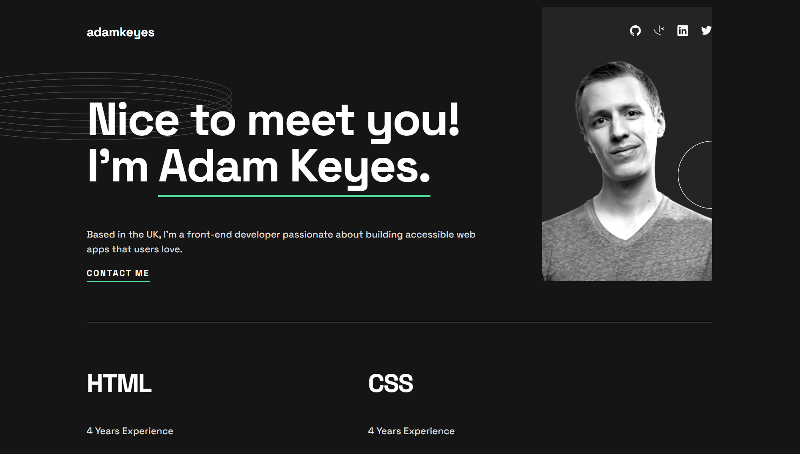

# Frontend Mentor - Single-page developer portfolio solution

This is a solution to the [Single-page developer portfolio challenge on Frontend Mentor](https://www.frontendmentor.io/challenges/singlepage-developer-portfolio-bBVj2ZPi-x).

## Table of contents

- [Overview](#overview)
  - [The challenge](#the-challenge)
  - [Screenshot](#screenshot)
  - [Links](#links)
- [My process](#my-process)
  - [Built with](#built-with)
  - [What I learned](#what-i-learned)
  - [Continued development](#continued-development)
- [Author](#author)

## Overview

### The challenge

Users should be able to:

- Receive an error message when the `form` is submitted if:
  - Any field is empty
  - The email address is not formatted correctly
- View the optimal layout for the interface depending on their device's screen size
- See hover and focus states for all interactive elements on the page

### Screenshot



### Links

- [Frontend Mentor Solution]()
- [Live Site]()

## My process

### Built with

- Semantic HTML5 markup
- SCSS
- Flexbox
- Mobile-first workflow

### What I learned

The name of the game for me lately has been just getting back to basics and creating web pages with standard HTML. This was a great project for that as it's a static single page site with no complex interactive components. It felt great just to focus on HTML and CSS for this one and get things looking as nice as possible. I made much greater use of `:has()` selectors than I have in the past on this one.

I particularly enjoyed using them for the hover effect on the projects section for the desktop view.

``` scss
.projects {
  article {
    img {
     transition: opacity 0.5s ease-in-out;
    }

    div + div {
      text-align: center;
      display: flex;
      flex-direction: column;
      padding: 0 12.5rem;
      width: 35rem;
      box-sizing: border-box;

      position: relative;
      top: -25.5rem;
      left: 1rem;

      transition: opacity 0.5s ease-in-out;
      opacity: 0%;

      > * + * {
      margin-block-start: 1rem;
      }
    }
  }

  article:has(img:hover), article:has(div + div:hover){
    img{
      opacity: 20%;
    }

    div + div {
      opacity: 100%;
    }
  }
}
```

Another goal I had was to write reusable CSS where content could just be added to the HTML with no issues. I think I had a moderate amount of success here, however there are some areas with some less than perfect practices and redundancies. Overall though I'm very proud of how this turned out.

### Continued development

I'm considering using this as a jumping off point for a new portfolio site for myself. Although I would really like to have some sort of Markdown renderer for the actual content to make this easier to update if I were to actually do that.

## Author

- Website - [Jeremy Helsel](https://www.jeremyhelsel.com)
- Frontend Mentor - [@JIH7](https://www.frontendmentor.io/profile/jih7)
